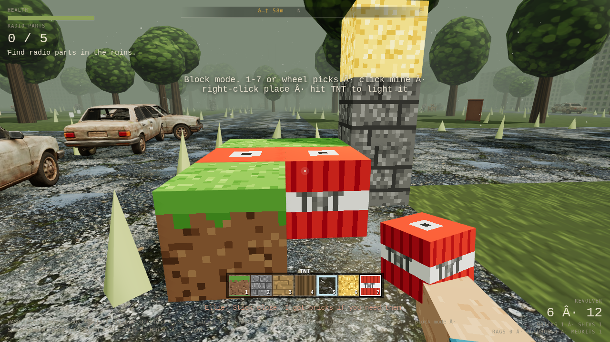
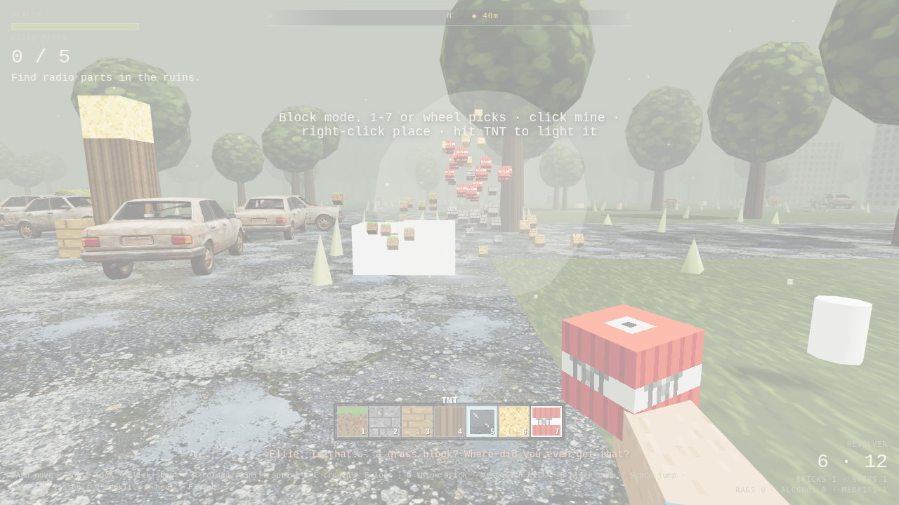
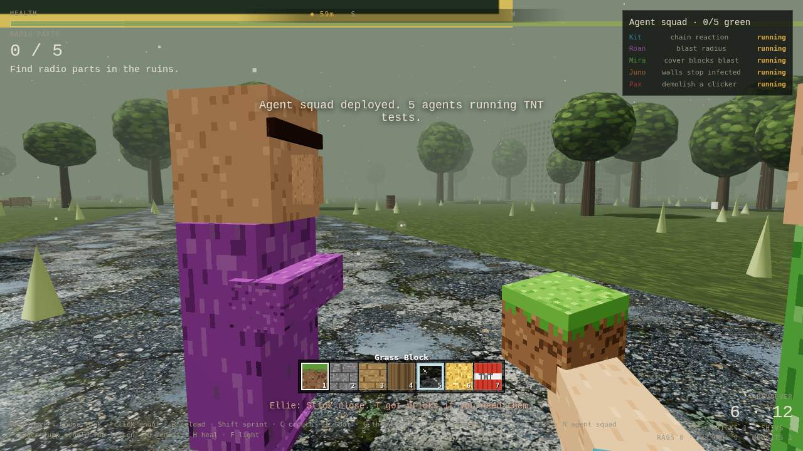

# Overgrowth

A Last of Us-style survival slice that runs in the browser, with real Minecraft TNT dropped into it and a squad of AI "agents" that test it live inside the game.

## Play
- **Locally:** `python3 -m http.server` in this folder, then open http://localhost:8000.
- **Online:** enable GitHub Pages (Settings → Pages → `main` / root) and play at `https://arnie016.github.io/overgrowth`.

## Controls
| Key | Action |
|---|---|
| WASD, mouse | Move and look |
| Click | Shoot (or mine, in block mode) |
| **B** | Block mode: Minecraft hotbar, blocks and TNT |
| 1–7 / wheel | Pick a block: grass, cobble, planks, log, glass, glowstone, TNT |
| Right-click | Place a block |
| Space | Jump and climb blocks |
| **N** | Deploy the agent squad |
| **Y** | Approve an agent's engine patch |
| Shift / C / Tab | Sprint, crouch, listen |
| G / V / E | Throw brick, stealth kill, loot |

## Minecraft inside the apocalypse
- Blocks sit on a 1 m grid with 16×16 pixel textures.
- You can stand on them and build bunkers, and the infected have to path around them.
- TNT chain-reacts, shreds builds, and turns infected into voxel debris. The noise pulls in every clicker within 70 m.

## The agent squad
Press **N** and five villagers walk out. Each one runs a single test in the live world, and its log scrolls on a chalkboard above its head:

| Agent | Test | What it checks |
|---|---|---|
| Kit | chain reaction | 4 TNT 2 m apart: lighting one must detonate all four |
| Roan | blast radius | cobble at 2 m is destroyed, planks at 5 m survive |
| Mira | cover blocks blast | planks behind a cobble wall should survive |
| Juno | walls stop infected | the collision probe is pushed out of a wall, but standing on top is free |
| Pax | demolish a clicker | finds a real infected, pins it, blows it up |

Mira's test fails on the stock engine, because blasts ignore cover. She walks over to you and asks to patch `explode()`. Press **Y**, and cobble then shields what's behind it and resists the blast. She re-runs her test and the board should turn green. (The re-run after Y hasn't been verified in automated tests yet.)

Inspired by AgentCraft (Claude agents working inside Minecraft), with the arrangement flipped: here the agents live inside the game they are testing.

## How it's built
- One `index.html`: three.js r128, procedural canvas textures, and a synth fallback for audio.
- `js/hf.js` loads the character, prop and texture GLBs (made with Higgsfield).
- `js/audio.js` is the horror sound engine.
- [`docs/`](docs/) holds a field note in the [universal-modder](https://github.com/rehan-remade/universal-modder) format. It covers the route, engine facts, verification and gotchas, so the next agent can repeat it.

Built with Claude Code.

## Storm inventory update — 5 October 2026

E/I opens a keyboard-accessible creative-style inventory; Esc closes. 1–7 selects blocks, 8 selects flint and steel, 9 selects the gun. R places a selected block or ignites aimed TNT with flint and steel; X recovers unlit blocks; gun mode uses left click to shoot and R reload. F loots, L toggles the flashlight. Inventory pauses the world and clears held controls. Health is 1,000; medkits restore 500. Storm lighting, cloud meshes, rain, thunder and reduced-motion flash guards are enabled. Existing Higgsfield GLBs now load using their real filenames on Pages; the pistol asset replaces the placeholder.

This public browser build implements voxel mechanics in JavaScript. It is not the separate native Java Minecraft integration or the newer Wren/save/checkpoint build. No licensed Minecraft runtime is bundled. No new paid assets were generated. Human play quality and broad device performance remain unverified.
